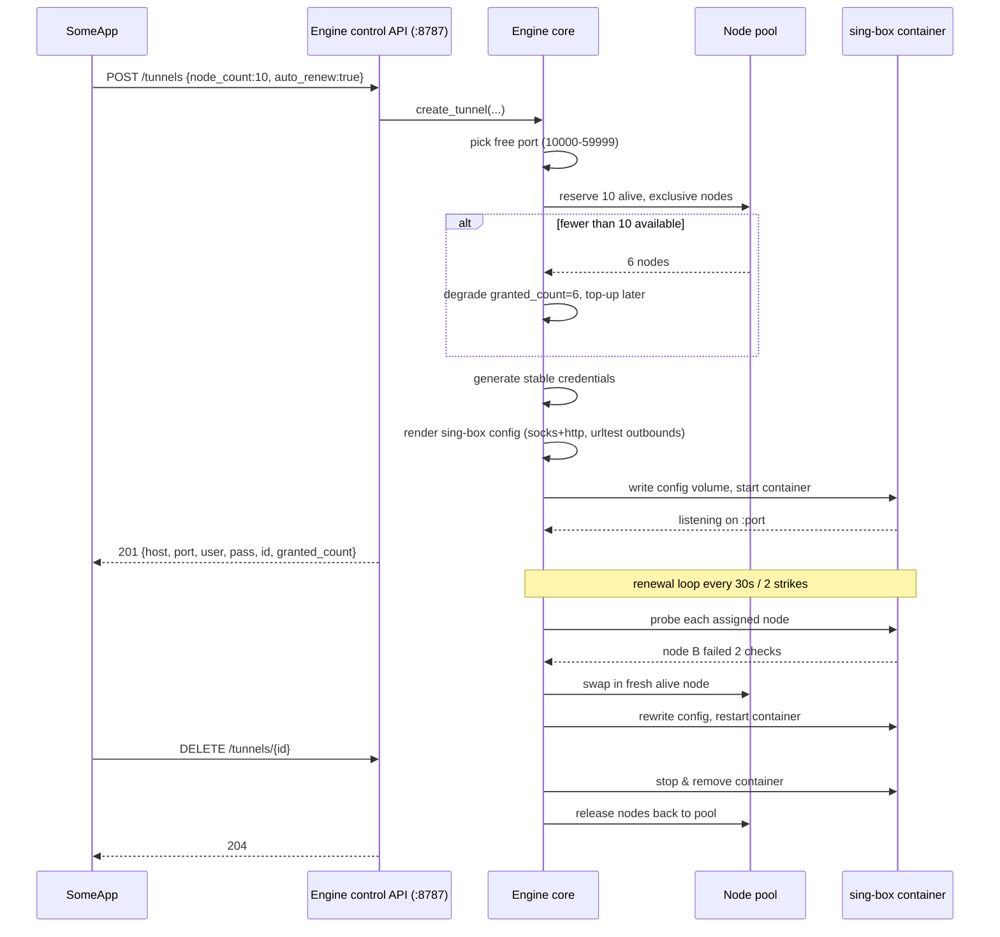
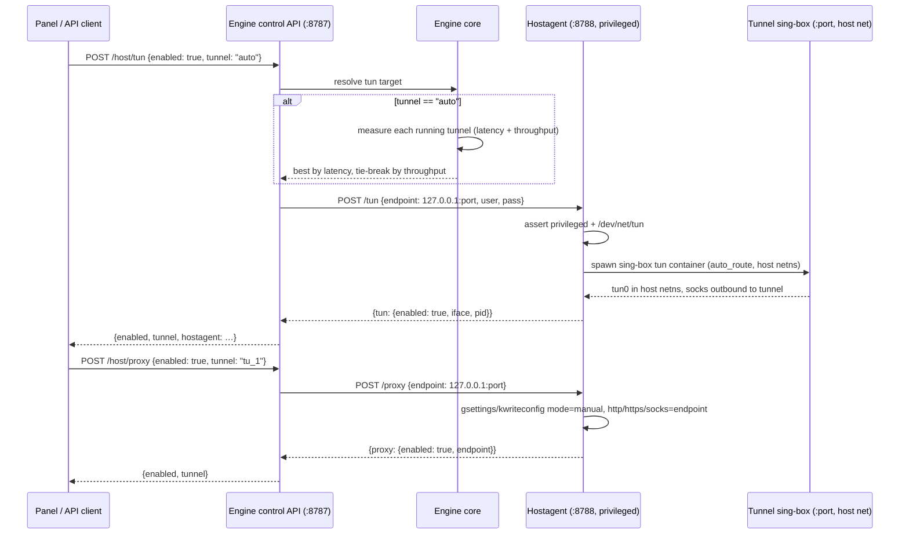

# Architecture

> Canonical vocabulary for the terms used here lives in
> [CONTEXT.md](../CONTEXT.md).

## Overview

InfinityProxy is a control plane plus a pool of short-lived, per-tunnel
[sing-box](https://sing-box.sagernet.org) containers. The **Engine** (a Flask
process) does the durable work — scraping, liveness filtering, node assignment,
renewal, and port/credential bookkeeping — while each **tunnel** is a single
sing-box container that exposes a rotating proxy endpoint to a client.

```text
                    ┌──────────────────── ENGINE (Flask :8787) ────────────────────┐
                    │                                                              │
Public feeds ─────► │  Scraper loop ─► Node pool ─► Liveness filter ─► Assigner    │
                    │       │                 │                        │            │
                    │       └── SQLite (state)◄┘                        │            │
                    │                                                   │            │
                    │  Control API (tunnels CRUD, nodes, status)        │            │
                    │  GET / → 302 to the panel                         │            │
                    └────────┬──────────────────────────────┬──────────────────────┘
                             │ render config, spawn/restart │  crawl status/tunnels
                             │ /stop per tunnel             │  every 5s
                             ▼                              ▼
                    ┌──────────────────── TUNNEL ────────────────────┐  ┌───────────────┐
                    │  sing-box container, SOCKS5 + HTTP inbound     │  │ PANEL (Flask  │
                    │  (user:pass) ←────────────── client            │  │  :8000)       │
                    │  outbound: urltest over k assigned nodes       │  │  SSE stream,  │
                    └────────────────────────────────────────────────┘  │  charts       │
                                                                       └───────────────┘
```

## Components

### The Engine

- Runs forever; the only always-on component.
- **Scraper loop** — walks the configured sources on their own cadences, fetches
  each raw feed, parses and deduplicates URI lists (see
  [docs/scraping.md](./scraping.md)).
- **Node pool** — in-memory working set of nodes that passed the liveness
  filter, persisted as a cache in SQLite for warm starts.
- **Liveness filter** — probes nodes with a real protocol handshake (plus a
  throughput certification at admission, [ADR-0008](./adr/0008-throughput-certified-pool.md)),
  batched and time-boxed (default batch 50, 4s timeout). Verdicts are written to
  the store batch-by-batch, so alive nodes surface while a full source pass
  still runs. Since [ADR-0009](./adr/0009-stability-scored-assignment.md) each
  verdict also accumulates into the node's windowed probe counters, and a
  dedicated **working-set loop** handshake-probes the top-256 alive unassigned
  nodes on a 5-minute cadence so probe history covers the pool the assigner
  draws from next — not just nodes that happen to be assigned.
- **Assigner** — hands each new tunnel an exclusive private set of alive nodes;
  with stability enabled it orders candidates Tier A (reliable) → B → cold by a
  Wilson availability + within-protocol speed score
  ([ADR-0009](./adr/0009-stability-scored-assignment.md)).
- **Control API** — Flask REST endpoints on `127.0.0.1:8787` (see
  [docs/api.md](./api.md)). `GET /` redirects to the panel.
- **Panel** — a second Flask process (`python -m panel`) on `127.0.0.1:8000`
  crawls the control API every 5s, keeps a 2h rolling history, and streams a
  snapshot to the browser over SSE (see [docs/dashboard.md](./dashboard.md)).

### Tunnels

One tunnel = one `sing-box` container + one row in SQLite.

A tunnel is created when a client calls `POST /tunnels`. The Engine:

1. Picks a free port from `INFINITY_TUNNEL_RANGE` (default `10000-59999`).
2. Asks the pool for up to `node_count` alive, unassigned nodes. If fewer are
   available it degrades gracefully and tops up later (see **Pool starvation**).
3. Generates credentials (`username`, `password`), **stable for the tunnel's
   lifetime** — renewals never change them.
4. Renders a sing-box config:
   - one `mixed` inbound serving SOCKS5 and HTTP on the tunnel port with auth
     (sing-box refuses two inbounds sharing a listen port),
   - one outbound per assigned node (VLESS/VMess/SS/SSR/Trojan/TUIC/Hy2 as the
     node's scheme requires),
   - grouped under a sing-box `urltest` outbound for **latency-weighted
     selection**.
5. Ships the config into a new tunnel container as an in-memory tar (no bind
   mount: the Docker daemon resolves mount sources on its own host, which breaks
   when the engine itself is containerized) and starts it.
6. Returns `{host, port, username, password, id, granted_count, ...}`.

The client connects to the tunnel port and sing-box exits through whichever
assigned node currently answers fastest for each request. Assignment changes
(swaps/additions) are rendered into a fresh config and the container is
restarted automatically by the Engine — the client never sees a different
host/port or credentials.

```text
client ──SOCKS5/HTTP──► tunnel:10244 ──urltest──► node A (fastest now)
                                             └──► node B
                                             └──► node C … k nodes
```

### The hostagent (host system proxy + TUN)

A **third, opt-in** component controls the Docker host's own traffic
([ADR-0010](./adr/0010-hostagent.md)): `hostagent/`, run via
`python -m hostagent` on its own loopback listener `127.0.0.1:8788`. It runs
`network_mode: host`, `privileged: true`, and mounts the docker socket and —
for desktop proxy support — the user session bus. It is the **only** component
with host-wide power. The engine orchestrates it over loopback HTTP exactly as
it orchestrates the panel; the panel stays a thin proxy.

| Service | Address | Env | Default |
| --- | --- | --- | --- |
| Hostagent control API | `127.0.0.1:8788` | `INFINITY_HOSTAGENT_PORT` | `8788` |

Deployment is gated behind a compose profile (`docker compose --profile host up
-d`) and `INFINITY_HOST_ENABLED`, so a default stack never starts a privileged
container. It is localhost-only and unauthenticated like the other control
surfaces (ADR-0003 semantics — loopback is the boundary).

Two host features ride on it:

- **System Proxy** — sets the desktop session's default HTTP(S)/SOCKS proxy to
  `127.0.0.1:<tunnel.port>` (GNOME `gsettings`, KDE `kwriteconfig5`; the setter
  is capability-detected, and a host without a detected desktop reports
  `capabilities.proxy: "none"` instead of failing). Disabling restores `none`.
- **TUN mode** — spawns a sing-box container (same image/pattern as tunnels)
  with a `tun` inbound (`auto_route`, `strict_route`, host network namespace)
  whose `socks` outbound dials the selected tunnel with its credentials. The
  whole host's traffic egresses through the tunnel. Requires a live tunnel.

The engine resolves the target tunnel. `tunnel: "auto"` runs **auto-pick-best**:
measure every running tunnel's egress (latency through the tunnel proxy, then a
download-throughput sample), pick the best latency, tie-break by throughput, and
cache the result for `INFINITY_HOST_PICK_TTL_S` (default 60s).

### SQLite store

A single SQLite file (default `infinity.db`) on a Docker volume persists:

- **tunnels** — id, state, port, credentials, `node_count` requested/granted,
  `auto_renew` flag, timestamps,
- **node cache** — node URIs, source, last-seen, last latency, certified
  throughput (KiB/s), assignment, and (since ADR-0009) the windowed probe
  counters `probe_ok`/`probe_total` plus `last_probe_s`/`last_alive_s`,
  `window_started_s`, and the cached availability term `score_f`.

Raw scrape batches are ephemeral. On boot the Engine loads this state and
**reconciles**: it adopts containers whose config still matches, and stops
orphans it no longer has a row for. It also frees any node assignment that
points at a tunnel with no row — a tunnel deleted outside the normal release
path (crash between release and delete, legacy data) must not leave its nodes
permanently "in use" and starve every degraded tunnel's top-up. Node liveness
is re-established by the filter loop within one cadence.

## Request flow (end to end)



## Host control flow (ADR-0010)



## Renewal loop (the "time" axis)

- Each tunnel with `auto_renew=true` is health-checked every **30s**.
- A node is probed with its own protocol handshake. After **2 consecutive
  failures** the node is marked dead and swapped.
- The swap draws from the node pool, preferring nodes already certified alive —
  and since [ADR-0008](./adr/0008-throughput-certified-pool.md), the nodes with
  the highest certified throughput. With stability enabled
  ([ADR-0009](./adr/0009-stability-scored-assignment.md)) the preference is the
  stability score instead: reliable Tier-A nodes first, by availability +
  within-protocol throughput percentile — and, where possible, not previously
  failed for this tunnel (see [ROADMAP](../ROADMAP.md) for the stricter
  avoidance goals).
- The health pass also **self-heals the container**: if the tunnel row is live
  but its container is no longer running, the engine redeploys it from the
  store and counts the event in `tunnel_health.restarts_24h`.
- Sources refetch on their own cadence (5 min–6 h), so the pool constantly
  replenishes with fresh candidates.

Degraded tunnels (`granted_count < requested`) are topped up opportunistically
on every health-check pass until they reach the requested count or the pool is
genuinely starved.

### Stability pipeline (ADR-0009)

The engine treats every verdict it already performs as evidence and grades the
pool on it ([ADR-0009](./adr/0009-stability-scored-assignment.md)):

- **Verdict accumulation.** Admission, health-loop, and working-set probes all
  write `apply_probe_results(..., stability=True)`, incrementing the node's
  `probe_ok`/`probe_total` inside its counter window. A verdict delivered more
  than `INFINITY_STABILITY_WINDOW_S` after `window_started_s` **folds** the
  counters (halves them) and restarts the window — recency weighting with no
  time-series table.
- **Working-set loop.** A daemon thread (`infinity-working-set`) selects the top
  `INFINITY_STABILITY_WORKING_SET` (256) alive, unassigned nodes by cached
  availability every `_CADENCE_S` (300s) and handshake-probes those due (guarded
  by `INFINITY_STABILITY_REPROBE_MIN_S`). Coverage therefore tracks the
  assignable slice of the pool, independent of assignment. The same query backs
  the `working_set` count the control API reports.
- **Freshness.** An evaluated node whose last verdict is older than
  `INFINITY_STABILITY_MAX_AGE_S` (21600s) leaves Tier A for Tier B until
  re-probed; a node never evaluated stays cold regardless of age.
- **Assignment.** With the feature enabled, `_admit_batch` records with the same
  fold semantics, and the assigner orders candidates Tier A → B → cold by the
  Wilson availability + within-protocol speed score (`engine/stability.py`).
  Latency remains sing-box `urltest`'s job.

The panel surfaces the resulting tier counts, mean availability, and working-set
count (see [docs/dashboard.md](./dashboard.md)); the tuned weights and their
benchmark evidence are recorded in [ADR-0009](./adr/0009-stability-scored-assignment.md)
and [docs/benchmark.md](./benchmark.md).

### Pool starvation

If the pool cannot satisfy `node_count` at creation time, the tunnel is created
with what is available:

- `node_count_granted < node_count_requested` in the response,
- `GET /tunnels` shows the delta,
- the renewal loop treats it as a top-up target.

The Engine never queues or blocks a create request on the pool.

## Ports, addresses, and security boundary

- Engine control API: `127.0.0.1:8787`, **localhost-only, no auth in v1** — see
  [ADR-0003](./adr/0003-localhost-control-api.md).
- Web panel: `127.0.0.1:8000`, same localhost-only rule — see
  [ADR-0007](./adr/0007-web-panel.md) and [docs/dashboard.md](./dashboard.md).
- Hostagent control API: `127.0.0.1:8788`, same localhost-only rule — the
  privileged host-control surface (opt-in, see [ADR-0010](./adr/0010-hostagent.md)).
- Mind that your public network is not published to Docker by default (see
  [CONTRIBUTING.md](../CONTRIBUTING.md)).
- Tunnels: one published port each, from `INFINITY_TUNNEL_RANGE`. Each tunnel
  binds its port and authenticates clients with per-tunnel credentials.
- Tunnel containers have **no** route to the Engine's control port; they only
  receive their rendered config and dial outbound.

## Repository layout

```text
InfinityProxy/
├── engine/                   # Flask control plane
│   ├── app.py                #   control API routes
│   ├── scheduler.py          #   renewal loop, health checks
│   ├── scraper/              #   per-source fetchers + parsers
│   ├── filter/               #   liveness probing, batch logic
│   ├── assigner.py           #   exclusive node allocation
│   ├── stability.py          #   ADR-0009 scoring: wilson_lower, tiers, percentiles
│   ├── tunnel/               #   sing-box config rendering + container control
│   └── db.py                 #   SQLite access
├── panel/                    # Flask web dashboard
│   ├── app.py                #   SSE stream, proxied actions, test-tunnel
│   ├── client.py             #   engine API client
│   ├── history.py            #   rolling chart history
│   └── static/               #   zero-build frontend + vendored Chart.js
├── hostagent/                # privileged host control (ADR-0010)
│   ├── app.py                #   loopback control API (:8788)
│   ├── platform.py           #   capabilities, gsettings/KDE proxy setter
│   └── singbox.py            #   TUN sing-box config renderer
├── demo/                     # GitHub Pages demo bootstrap (static fixtures)
├── tunnel-image/             # Docker image wrapping sing-box for tunnels
├── tools/                    # benchmark harness
├── tests/                    # unit tests (parser, filter, assigner, app, panel)
├── docs/
├── CONTEXT.md
└── ...
```

## Decisions

Relevant architecture decision records:

- [0001 Per-tunnel sing-box containers](./adr/0001-per-tunnel-containers.md)
- [0002 SQLite store](./adr/0002-sqlite-store.md)
- [0003 Localhost control API](./adr/0003-localhost-control-api.md)
- [0004 MIT with upstream attribution](./adr/0004-mit-and-attribution.md)
- [0005 Latency-weighted rotation](./adr/0005-latency-weighted-rotation.md)
- [0006 Certified liveness v2 (probe policy)](./adr/0006-relay-grade-liveness-probes.md)
- [0007 Web panel (localhost, unauthenticated)](./adr/0007-web-panel.md)
- [0008 Throughput-certified pool](./adr/0008-throughput-certified-pool.md)
- [0009 Stability-scored assignment](./adr/0009-stability-scored-assignment.md)
- [0010 Host system proxy + TUN via hostagent](./adr/0010-hostagent.md)